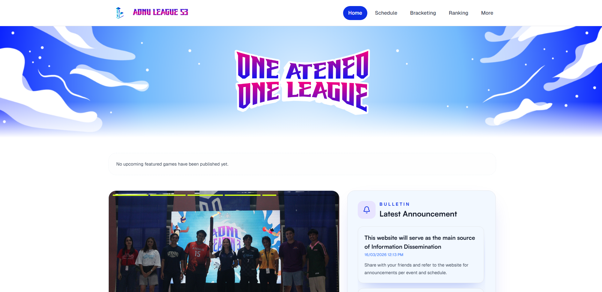

# John Francis H. Mendoza 👋 

  
  
  

I am a third-year BS Computer Science student at Ateneo de Naga University with strong interests in Software Engineering, Full-Stack Development and Cybersecurity. I have hands-on experience building and deploying production-grade applications where I collaborated in a cross-functional team to support a high-traffic user base. I am proficient in Python, SQL, and Java, and I actively use AI-assisted development tools to accelerate implementation and troubleshooting. I am committed to building secure, reliable solutions, backed by a strong foundation in Machine Learning and Network Security.

---

### 🚀 Featured Project: ADNU League Season 3
**Lead Front-End Developer | Full-Stack Architecture & Deployment**

  

> Orchestrated the university’s premier high-traffic platform, serving as the single source of truth for 11,000+ users.

* **Scalability & Traffic:** Successfully handled over **52,000 total page views** and **11,000 unique visitors** during a peak 5-day event.
* **System Reliability:** Maintained **99.9% uptime** under heavy concurrent load through a optimized **Vercel** deployment pipeline.
* **Real-Time Data:** Architected production-grade backends using **Supabase** to manage instant tournament brackets, standings, and automated updates.
* **AI-Enhanced Velocity:** Utilized **GitHub Copilot** as a primary tool for rapid prototyping, debugging, and feature deployment during a strict two-week sprint.
* **Security Post-Mortem:** Identified and resolved critical unauthorized information disclosure risks, implementing improved permission scoping and data abstraction for production security.

---

### 🛠 Technical Toolkit

| Category | Skills & Tools |
| :--- | :--- |
| **Languages** |      |
| **Frontend** |    |
| **Backend** |    |
| **Infrastructure** |    |
| **Security & AI** |    |

---

### ✅ Professional Certifications
* 📜 **Python Essentials 1 & 2** – Cisco Networking Academy (2025) 
* 🚩 **DECODE 2025 - University Capture the Flag** – Trend Micro Philippines 

---

### 📫 Connect with Me

